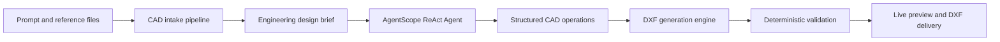

<div align="center">

# Agent-CAD

### AI-Native CAD Engineering Agent

**Turn engineering requirements, reference files, and natural-language instructions into structured 2D drawings and validated DXF deliverables.**

[](LICENSE)
[](backend/pyproject.toml)
[](https://github.com/agentscope-ai/agentscope)
[](backend/app/main.py)
[](frontend/src/main.ts)
[](https://github.com/Jane-o-O-o-O/Agent-CAD/blob/main/docs/agent-cad-technical-design.md)

[中文文档](README_zh.md) · [Technical Design](https://github.com/Jane-o-O-o-O/Agent-CAD/blob/main/docs/agent-cad-technical-design.md) · [Quick Start](#quick-start)

</div>

---

## About Agent-CAD

Agent-CAD is an open-source, domain-focused AI Agent for engineering drawing automation. Instead of stopping at text suggestions or generating opaque image previews, it converts design intent into **explicit CAD geometry**, executes drawing operations through a controlled toolchain, validates the result, and delivers an editable DXF file.

The project combines an AgentScope-based ReAct runtime, multi-format engineering document intake, deterministic CAD operations, live drawing preview, and isolated execution. Its goal is to make repetitive 2D drafting work faster while keeping geometry inspectable, outputs editable, and engineering decisions traceable.

> Agent-CAD is not a generic chatbot with a CAD prompt. It is an engineering Agent workflow built around requirement extraction, geometry planning, tool execution, validation, and delivery.

## Why Agent-CAD

| Traditional workflow | Agent-CAD workflow |
|---|---|
| Manually interpret scattered notes, tables, and sketches | Extract drawing requirements from prompts and uploaded references |
| Recreate geometry entity by entity | Plan and execute structured CAD operations |
| Review dimensions and layers after drafting | Preserve dimensions, annotations, centerlines, and layer semantics during generation |
| Discover malformed output when opening the file | Parse and validate the DXF before delivery |
| Repeat the process for every revision | Continue from session context and refine the same engineering task conversationally |

## From Requirement to Drawing



1. **Understand** the requested part, diagram, dimensions, units, constraints, and uncertain items.
2. **Plan** a bounded CAD workflow and ask for clarification only when missing data changes the drawing topology or engineering meaning.
3. **Generate** explicit geometry such as lines, polylines, circles, holes, slots, arcs, dimensions, center marks, and notes.
4. **Validate** the DXF structure and entity content before the file is presented to the user.
5. **Deliver** an editable drawing with an in-browser preview and a concise record of sources and assumptions.

## Core Capabilities

### CAD-Specialized Agent

- AgentScope 2.0 runtime with a bounded ReAct loop for analysis, planning, tool execution, observation, correction, and delivery.
- Dedicated CAD skill routing for mechanical drawings, engineering diagrams, electrical control schematics, and process diagrams.
- Structured design briefs capture units, features, constraints, manufacturing notes, source references, and unresolved requirements.
- Session-aware conversations support follow-up changes instead of treating every revision as a new task.

### Engineering File Intelligence

- Accepts natural-language requirements and uploaded PDF, DOC/DOCX, spreadsheet, image, text, archive, and CAD-related files.
- Uses a typed parser pipeline with Docling-assisted extraction and format-specific fallbacks.
- Extracts dimensions, symbols, equipment tags, connection relationships, notes, and other drawing evidence into Agent context.
- Keeps source references and assumptions visible so generated output remains reviewable.

### Structured Drawing and DXF Delivery

- Generates geometry from explicit specifications rather than relying on unstructured code snippets.
- Supports lines, arcs, circles, holes, rectangles, polylines, slots, center marks, dimensions, and text annotations.
- Applies engineering-oriented layers such as `M-OBJECT`, `M-HOLE`, `M-CENTER`, `M-DIM`, and `M-NOTE`.
- Produces R2010/R2018-compatible DXF through `ezdxf`, then reopens and validates the result before delivery.

### Professional CAD Workspace

- Vue 3 and TypeScript workbench with chat/task context beside a live 2D CAD viewport.
- DXF rendering, zoom, pan, fit-to-view, grid, layer visibility, and file download support.
- Real-time Agent events expose task progress and tool activity instead of hiding execution behind a loading state.
- Docker sandbox isolates shell, browser, and file operations for safer automated workflows.

## Supported Use Cases

| Category | Examples |
|---|---|
| Mechanical 2D | Mounting plates, flanges, brackets, hole patterns, slots, rounded corners, centerlines, dimensions |
| Engineering diagrams | Electrical control schematics, process diagrams, equipment and connection relationship drawings |
| Document-to-CAD | Convert requirements from Word, PDF, spreadsheets, images, scans, archives, or existing references into DXF |
| Drawing assistance | Requirement breakdown, modeling plans, drawing checks, missing dimensions, layers, annotations, and revision guidance |

### Current Product Boundary

Agent-CAD currently focuses on clean, editable **2D engineering drawings with DXF as the primary deliverable**. Native DWG authoring, production-grade 3D solids, assemblies, STEP/STL output, and automatic standards certification are not presented as completed capabilities.

## Technology Stack

| Layer | Technology |
|---|---|
| Agent runtime | AgentScope 2.0, ReAct workflow, tool calling, skill routing, MCP integration |
| Model access | OpenAI-compatible APIs with configurable model providers |
| CAD engine | `ezdxf`, structured CAD operations, DXF parsing and validation |
| Document intelligence | Docling, pypdf, openpyxl, Pillow, format-specific parsers |
| Backend | Python 3.12, FastAPI, Pydantic v2, Beanie/Motor |
| Frontend | Vue 3, TypeScript, Vite, Tailwind CSS, `dxf-viewer` |
| Runtime infrastructure | Docker sandbox, MongoDB 7, Redis 7, SSE/WebSocket streaming |

## Architecture

Agent-CAD separates probabilistic reasoning from deterministic engineering execution:

- The **Agent** interprets intent, identifies missing information, plans operations, and explains results.
- The **CAD toolchain** owns geometry creation, layer semantics, serialization, and file validation.
- The **intake pipeline** converts heterogeneous engineering references into normalized evidence.
- The **sandbox** isolates file and tool execution.
- The **web workbench** streams progress and renders the current drawing state.

This separation keeps the system extensible without allowing the language model to become the source of truth for CAD file integrity.

## Quick Start

### Prerequisites

- Docker 20.10+
- Docker Compose
- An OpenAI-compatible model endpoint with tool/function calling support

### Run with Docker Compose

```bash
git clone https://github.com/Jane-o-O-o-O/Agent-CAD.git
cd Agent-CAD
cp .env.example .env
```

Set at least the following values in `.env`:

```ini
API_KEY=sk-xxxx
API_BASE=https://api.openai.com/v1
MODEL_NAME=gpt-4o
```

Start the development stack:

```bash
./dev.sh up -d
```

Open <http://localhost:5173>. The backend API is available at <http://localhost:8000>.

### Local Development

Backend:

```bash
cd backend
uv sync
uv run uvicorn app.main:app --host 0.0.0.0 --port 8000 --reload
```

Frontend:

```bash
cd frontend
npm install
BACKEND_URL=http://localhost:8000 npm run dev
```

## Project Structure

```text
Agent-CAD/
├── frontend/       # Vue CAD workbench, chat UI, DXF preview
├── backend/        # Agent runtime, CAD tools, parsers, APIs, persistence
│   ├── app/domain/services/agentscope_runtime/
│   ├── app/domain/services/tools/cad.py
│   ├── app/infrastructure/cad_parsers/
│   └── skills/cad-drawing-analysis/
├── sandbox/        # Isolated shell, browser, file, and desktop runtime
├── claw/           # Optional OpenClaw integration
├── mockserver/     # Local model-response simulator for development
└── docs/           # Architecture and technical design documentation
```

## Verification

```bash
# Backend unit and integration checks
cd backend
uv run pytest

# Frontend type and production-build checks
cd frontend
npm run type-check
npm run build
```

Some backend tests require MongoDB, Redis, and the backend service to be running. See the repository development instructions for the relevant test setup.

## Roadmap

- Richer geometry editing, revision history, undo, and document version comparison.
- Deterministic constraint solving, collision checks, closed-contour checks, and missing-dimension analysis.
- Drawing sheet templates and expanded PDF/PNG export.
- Deeper standards-aware validation and configurable enterprise drafting rules.
- Additional CAD interchange formats and more advanced mechanical modeling workflows.
- Kubernetes-oriented multi-instance deployment and production observability.

## Acknowledgements

Agent-CAD evolves from the open-source AI Manus Agent foundation and specializes its session, sandbox, streaming, and tool infrastructure for CAD engineering workflows. The project also builds on AgentScope, ezdxf, Docling, FastAPI, Vue, MongoDB, Redis, and the wider open-source ecosystem.

## License

Distributed under the [MIT License](LICENSE).
