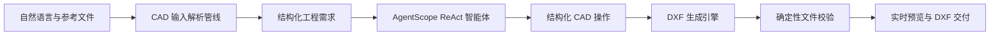

<div align="center">

# Agent-CAD

### AI 原生 CAD 工程智能体

**将工程需求、参考文件与自然语言指令，转化为结构化二维图纸和经过校验的 DXF 交付物。**

[](LICENSE)
[](backend/pyproject.toml)
[](https://github.com/agentscope-ai/agentscope)
[](backend/app/main.py)
[](frontend/src/main.ts)
[](https://github.com/Jane-o-O-o-O/Agent-CAD/blob/main/docs/agent-cad-technical-design.md)

[English](README.md) · [技术设计](https://github.com/Jane-o-O-o-O/Agent-CAD/blob/main/docs/agent-cad-technical-design.md) · [快速开始](#快速开始)

</div>

---

## 关于 Agent-CAD

Agent-CAD 是面向工程制图自动化的开源垂直 AI Agent。它不止提供文字建议或生成不可编辑的图片，而是将设计意图转化为**明确、可审查的 CAD 几何结构**，通过受控工具链执行绘图操作，对结果进行解析校验，并交付可继续编辑的 DXF 文件。

项目融合 AgentScope ReAct 智能体运行时、多格式工程文档解析、确定性 CAD 操作、实时图纸预览与隔离执行环境，目标是在保障几何可检查、文件可编辑、工程决策可追溯的前提下，显著降低重复二维制图工作的沟通与执行成本。

> Agent-CAD 不是“通用聊天机器人 + CAD 提示词”，而是一套围绕需求提取、几何规划、工具执行、结果校验和工程交付构建的专业智能体工作流。

## 为什么选择 Agent-CAD

| 传统工作方式 | Agent-CAD 工作方式 |
|---|---|
| 人工整理分散在文档、表格和草图中的需求 | 从自然语言和上传资料中提取绘图要求与约束 |
| 逐个实体重复绘制和调整 | 规划并执行结构化 CAD 操作 |
| 完成后再集中检查尺寸、标注和图层 | 在生成阶段保留尺寸、中心线、注释和图层语义 |
| 打开文件后才发现格式或实体异常 | 交付前重新解析并校验 DXF 文件 |
| 每次修改都需要重新沟通和绘制 | 基于会话上下文持续修改同一工程任务 |

## 从需求到图纸



1. **理解需求**：识别零件或图纸类型、尺寸、单位、特征、约束及不确定项。
2. **规划任务**：生成边界清晰的 CAD 执行计划，仅在缺失信息影响拓扑或工程含义时请求确认。
3. **生成几何**：创建直线、多段线、圆、孔、槽、圆弧、尺寸、中心标记和文字注释等明确实体。
4. **校验结果**：在交付前检查 DXF 结构、版本和实体内容，失败时进入修正流程。
5. **完成交付**：提供浏览器内图纸预览、可编辑 DXF 文件，以及来源、假设和不确定项说明。

## 核心能力

### CAD 垂直智能体

- 基于 AgentScope 2.0 构建受控 ReAct 循环，覆盖分析、规划、工具调用、观察、修正与最终交付。
- 通过专用 Skill 路由机械图、工程图、电气控制原理图和工艺流程图等 CAD 任务。
- 使用结构化设计简报记录单位、特征、约束、制造说明、来源证据和待确认信息。
- 支持会话级上下文与连续修改，使图纸迭代成为可追踪的工程过程。

### 工程文件理解

- 支持自然语言，以及 PDF、DOC/DOCX、表格、图片、文本、压缩包和 CAD 相关文件输入。
- 采用类型化解析管线，结合 Docling 与格式专用解析器完成内容提取和降级处理。
- 从资料中提取尺寸、符号、设备标签、连接关系、技术说明和其他绘图证据。
- 保留来源引用、解析告警与默认假设，方便工程人员复核生成依据。

### 结构化绘图与 DXF 交付

- 优先根据明确的几何规格生成图纸，避免依赖不可控的临时代码或纯文本描述。
- 支持直线、圆弧、圆、孔、矩形、多段线、槽、中心标记、尺寸和文字注释。
- 使用 `M-OBJECT`、`M-HOLE`、`M-CENTER`、`M-DIM`、`M-NOTE` 等工程语义图层。
- 基于 `ezdxf` 生成 R2010/R2018 DXF，并在交付前重新读取和校验文件。

### 专业 CAD 工作台

- 基于 Vue 3 与 TypeScript 构建对话、任务过程和二维 CAD 画布并列的工程工作区。
- 支持 DXF 渲染、缩放、平移、适配视图、网格、图层显隐与文件下载。
- 通过实时事件展示 Agent 任务进度和工具活动，避免将执行过程隐藏在单一加载状态之后。
- 使用 Docker 沙箱隔离 Shell、浏览器和文件操作，提高自动化任务的安全性与可控性。

## 适用场景

| 类别 | 典型任务 |
|---|---|
| 机械二维制图 | 安装板、法兰、支架、孔阵列、槽口、圆角、中心线及尺寸标注 |
| 工程关系图 | 电气控制原理图、工艺流程图、设备标签与连接关系图 |
| 文档转 CAD | 从 Word、PDF、表格、图片、扫描件、压缩包或既有资料生成 DXF |
| 图纸辅助 | 需求拆解、建模方案、图纸检查、尺寸补全、图层与标注优化、修改建议 |

### 当前产品边界

Agent-CAD 当前聚焦于可编辑的**二维工程图，并以 DXF 作为主要交付格式**。原生 DWG 编写、生产级三维实体、装配体、STEP/STL 输出及自动化标准认证尚未作为已完成能力进行宣传。

## 技术栈

| 层级 | 技术方案 |
|---|---|
| Agent 运行时 | AgentScope 2.0、ReAct 工作流、工具调用、Skill 路由、MCP 扩展 |
| 模型接入 | OpenAI 兼容接口，可配置不同模型服务商 |
| CAD 引擎 | `ezdxf`、结构化 CAD 操作、DXF 解析与校验 |
| 文档智能 | Docling、pypdf、openpyxl、Pillow、格式专用解析器 |
| 后端 | Python 3.12、FastAPI、Pydantic v2、Beanie/Motor |
| 前端 | Vue 3、TypeScript、Vite、Tailwind CSS、`dxf-viewer` |
| 基础设施 | Docker 沙箱、MongoDB 7、Redis 7、SSE/WebSocket 实时通信 |

## 架构理念

Agent-CAD 将概率性的智能体推理与确定性的工程执行明确分层：

- **Agent** 负责理解意图、发现缺失信息、规划操作和解释结果。
- **CAD 工具链** 负责几何创建、图层语义、文件序列化与结果校验。
- **输入解析管线** 负责将不同格式的工程资料转化为标准化证据。
- **沙箱环境** 负责隔离文件处理和工具执行。
- **Web 工作台** 负责实时展示过程并渲染当前图纸状态。

这种架构既保留了大模型处理复杂语义的能力，也避免让语言模型直接成为 CAD 文件正确性的唯一依据。

## 快速开始

### 环境要求

- Docker 20.10+
- Docker Compose
- 支持工具或函数调用的 OpenAI 兼容模型服务

### 使用 Docker Compose 启动

```bash
git clone https://github.com/Jane-o-O-o-O/Agent-CAD.git
cd Agent-CAD
cp .env.example .env
```

在 `.env` 中至少配置：

```ini
API_KEY=sk-xxxx
API_BASE=https://api.openai.com/v1
MODEL_NAME=gpt-4o
```

启动开发环境：

```bash
./dev.sh up -d
```

浏览器访问 <http://localhost:5173>，后端 API 默认位于 <http://localhost:8000>。

### 本地开发

后端：

```bash
cd backend
uv sync
uv run uvicorn app.main:app --host 0.0.0.0 --port 8000 --reload
```

前端：

```bash
cd frontend
npm install
BACKEND_URL=http://localhost:8000 npm run dev
```

## 项目结构

```text
Agent-CAD/
├── frontend/       # Vue CAD 工作台、对话界面、DXF 预览
├── backend/        # Agent 运行时、CAD 工具、解析器、API 与持久化
│   ├── app/domain/services/agentscope_runtime/
│   ├── app/domain/services/tools/cad.py
│   ├── app/infrastructure/cad_parsers/
│   └── skills/cad-drawing-analysis/
├── sandbox/        # 隔离的 Shell、浏览器、文件和桌面运行环境
├── claw/           # 可选的 OpenClaw 集成
├── mockserver/     # 用于开发测试的模型响应模拟服务
└── docs/           # 架构与技术设计文档
```

## 验证方式

```bash
# 后端单元与集成测试
cd backend
uv run pytest

# 前端类型检查与生产构建
cd frontend
npm run type-check
npm run build
```

部分后端测试需要 MongoDB、Redis 与后端服务处于运行状态，请按照仓库开发说明准备测试环境。

## 路线图

- 完善几何编辑、修改历史、撤销和图纸版本对比。
- 增加确定性约束求解、碰撞检查、闭合轮廓检查和缺失尺寸分析。
- 支持工程图框模板，并扩展 PDF/PNG 输出能力。
- 深化标准化校验与可配置的企业制图规则。
- 扩展更多 CAD 交换格式与高级机械建模工作流。
- 推进面向 Kubernetes 的多实例部署与生产可观测能力。

## 致谢

Agent-CAD 基于开源 AI Manus Agent 基础能力演进，并将其会话、沙箱、实时事件和工具基础设施专业化为 CAD 工程工作流。项目同时受益于 AgentScope、ezdxf、Docling、FastAPI、Vue、MongoDB、Redis 及更广泛的开源生态。

## 开源许可

本项目采用 [MIT License](LICENSE) 开源许可。
